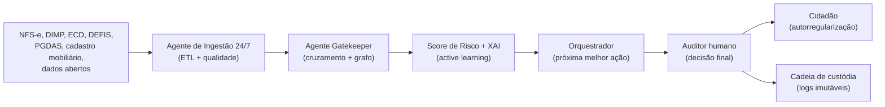

# FiscoCheck AI

> Plataforma de **Inteligência Fiscal Agêntica** para a Secretaria Municipal da Fazenda de Brusque/SC.
>
> Edital CPSI — Proponente: **Beyond / Aurora**.

A solução atua como um **mecanismo de triagem fiscal inteligente e automatizado**: agentes de IA autônomos operando em regime 24/7 ingerem, cruzam, auditam e pré-priorizam indícios de inconsistência fiscal **antes** de chegarem ao auditor humano.

**Princípio fundamental — Human-in-the-loop:** os agentes preparam, recomendam e instruem; **a decisão é sempre do auditor**. Toda ação com efeito sobre o contribuinte exige auditor autenticado, respeita o RBAC e o sigilo fiscal (art. 198 do CTN) e é registrada em logs imutáveis.

---

## Sumário

- [Visão geral](#visão-geral)
- [Módulos da plataforma](#módulos-da-plataforma)
- [Stack técnica](#stack-técnica)
- [Estrutura do repositório](#estrutura-do-repositório)
- [Pré-requisitos](#pré-requisitos)
- [Quickstart](#quickstart)
- [Scripts disponíveis](#scripts-disponíveis)
- [Convenções](#convenções)
- [Conformidade e segurança](#conformidade-e-segurança)
- [Documentação](#documentação)

---

## Visão geral

A plataforma transcende o armazenamento e a análise passiva de bases tributárias: propõe **inteligência ativa** com agentes autônomos que liberam o auditor da conferência manual para que ele atue como **Gestor Estratégico da Arrecadação**.



## Módulos da plataforma

1. **Integração, Ingestão e Qualidade de Dados** — ETL multifonte, pseudonimização LGPD, agente 24/7
2. **Cruzamento e Detecção de Inconsistências** — confronto declarado vs. NFS-e, graph analytics, CTC
3. **Inteligência Artificial e Análise Preditiva** — score de risco, redes, explicabilidade, active learning
4. **Gestão da Fiscalização e Autorregularização** — orquestrador, dossiê, multicanal cidadão
5. **Monitoramento Estratégico e Relatórios** — dashboards, alertas, agente de relatórios
6. **Segurança, Governança e Conformidade** — guardrails, RBAC, cadeia de custódia, LGPD
7. **Suporte, Capacitação e Funcionalidades Adicionais** — copilot fiscal, simulador, geofiscalização

Especificações detalhadas em [`docs/modules/`](./docs/modules/).

## Stack técnica

| Camada | Tecnologia | Justificativa |
|---|---|---|
| Frontend | Next.js 15 (App Router) + TypeScript | SSR/Streaming para painéis pesados, contratos tipados |
| UI | Tailwind CSS v4 + shadcn/ui | Design system controlado pelo time; tokens nativos no CSS |
| Estado | Zustand + TanStack Query v5 | Estado local simples + cache de servidor robusto |
| Backend | FastAPI + Python 3.12 | Ecossistema maduro para IA/ML/agentes |
| ETL | Polars | 5–10x mais rápido que Pandas para volumes fiscais |
| Agentes IA | LangGraph | Máquinas de estado com human-in-the-loop nativo |
| Banco | PostgreSQL 16 + pgvector (AGE adiado — ver [ADR-0002](./docs/adr/0002-database-mvp-replit.md)) | Relacional + embeddings num só banco; grafo do Módulo 2 em NetworkX in-memory no MVP |
| Cache/fila | Redis 7 | Cache, filas Celery/Arq, sessões |
| Runtime | Node 22, Python 3.12, pnpm 9 | LTS estáveis exigidos pelo Replit |
| Lint/format | Biome (web) + Ruff (api) | Latência baixa, formatação rápida |
| Hospedagem | Replit (piloto) → AWS/Azure Brasil (produção) | LGPD recomenda localização nacional |

## Estrutura do repositório

```text
fiscocheck-ai/
├── apps/
│   ├── web/                  # Next.js 15 — UI do auditor
│   └── api/                  # FastAPI — agentes, ETL, ML
├── packages/
│   ├── shared-types/         # tipos TS gerados do OpenAPI
│   ├── tsconfig/             # configs TS compartilhadas
│   └── biome-config/         # config Biome compartilhada
├── docs/
│   ├── design-system/        # ← coloque seu DS aqui
│   ├── architecture/         # ADRs, diagramas, data model
│   ├── adr/                  # decisões arquiteturais
│   ├── compliance/           # LGPD, sigilo fiscal, RIPD, ROPA
│   └── modules/              # spec dos 7 módulos
├── infra/
│   └── docker-compose.yml    # dev local (postgres + redis)
├── .claude/skills/           # skills do Claude Code
├── .github/workflows/        # CI: lint, typecheck, build, test
└── .replit + replit.nix      # runtime no Replit
```

## Pré-requisitos

- **Node.js** ≥ 22.0.0 ([nvm-windows](https://github.com/coreybutler/nvm-windows) recomendado)
- **pnpm** ≥ 9.0.0 (`corepack enable && corepack prepare pnpm@latest --activate`)
- **Python** 3.12.x ([pyenv-win](https://github.com/pyenv-win/pyenv-win) recomendado)
- **uv** (`pip install uv` ou via [winget](https://github.com/astral-sh/uv))
- **Docker Desktop** (opcional, para subir Postgres + Redis localmente)
- **PowerShell 7+** (Windows) ou Bash 5+ (Linux/macOS)

No Replit, tudo isso já vem provisionado pelo [`replit.nix`](./replit.nix).

## Quickstart

```powershell
# 1. Clonar e instalar dependências
git clone <repo-url> fiscocheck-ai
cd fiscocheck-ai
pnpm install

# 2. Copiar variáveis de ambiente
copy .env.example .env
copy apps\web\.env.example apps\web\.env.local
copy apps\api\.env.example apps\api\.env

# 3. Subir Postgres + Redis (Docker)
docker compose -f infra/docker-compose.yml up -d

# 4. Instalar dependências Python
cd apps\api
uv sync
cd ..\..

# 5. Rodar tudo em paralelo (web + api)
pnpm dev

# Web:  http://localhost:3000
# API:  http://localhost:8000  (docs em /docs)
```

No **Replit**, basta clicar em **Run** — o workflow `Dev (web + api)` sobe ambos.

## Scripts disponíveis

| Comando | Descrição |
|---|---|
| `pnpm dev` | Roda `apps/web` e `apps/api` em paralelo |
| `pnpm web:dev` | Apenas o frontend Next.js |
| `pnpm api:dev` | Apenas o backend FastAPI |
| `pnpm lint` | Lint em todos os pacotes (Biome + Ruff) |
| `pnpm lint:fix` | Lint com autofix |
| `pnpm typecheck` | `tsc --noEmit` no web + Pyright no api |
| `pnpm build` | Build de produção do web |
| `pnpm test` | Vitest no web + pytest no api |
| `pnpm format` | Format com Biome + Ruff |

## Convenções

- **Idioma:** documentação, comentários e mensagens de UI em **pt-BR**; identificadores de código em inglês (`riskScore`, não `pontuacaoDeRisco`).
- **Commits:** [Conventional Commits](https://www.conventionalcommits.org/pt-br/) (validado por commitlint).
  - Tipos: `feat`, `fix`, `docs`, `style`, `refactor`, `perf`, `test`, `build`, `ci`, `chore`.
  - Exemplo: `feat(crossing): adicionar deteccao de subdeclarante via grafo`.
- **Branches:** `main` (produção) ← `develop` (integração) ← `feat/*`, `fix/*`, `chore/*`.
- **PRs:** título em Conventional Commits, descrição com contexto + checklist de testes.
- **Lint:** Biome (web) + Ruff (api). `pnpm lint` deve passar antes do commit (Husky bloqueia).
- **Tipos:** sem `any` em código novo; sem `# type: ignore` sem justificativa em comentário.

Veja [`CONTRIBUTING.md`](./CONTRIBUTING.md) para o fluxo completo.

## Conformidade e segurança

Este projeto trata dados fiscais e identificáveis sob:

- **Lei nº 13.709/2018 (LGPD)** — pseudonimização, RIPD, ROPA, retenção, resposta a incidente ≤ 24h
- **Art. 198 do CTN** — sigilo fiscal, segregação por papel
- **Edital CPSI Brusque/SC** — cadeia de custódia auditável, MFA, RBAC, logs imutáveis

Documentação detalhada em [`docs/compliance/`](./docs/compliance/).

**Reporte vulnerabilidades** seguindo [`SECURITY.md`](./SECURITY.md).

## Documentação

- [AGENTS.md](./AGENTS.md) — instruções para coding agents (frontend, backend, QA, security)
- [CLAUDE.md](./CLAUDE.md) — específico para Claude Code / Replit Agent
- [replit.md](./replit.md) — guia de execução no Replit
- [CONTRIBUTING.md](./CONTRIBUTING.md) — fluxo de contribuição
- [docs/architecture/](./docs/architecture/) — visão arquitetural e modelo de dados
- [docs/adr/](./docs/adr/) — Architecture Decision Records
- [docs/modules/](./docs/modules/) — especificações dos 7 módulos
- [docs/compliance/](./docs/compliance/) — LGPD, sigilo fiscal, templates
- [docs/design-system/](./docs/design-system/) — design system (a popular)

---

**FiscoCheck AI** — porque a atenção do auditor vale muito.
