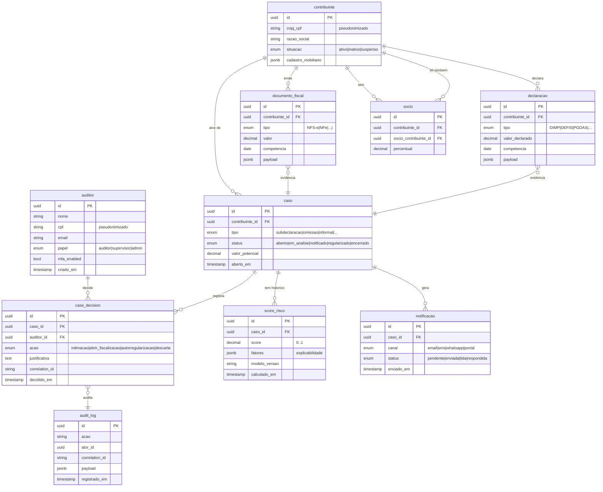

# Modelo de Dados — visão preliminar

> Este documento descreve o **modelo conceitual** dos dados do FiscalCheck AI. O modelo físico será materializado em migrations Alembic conforme cada módulo entrar em desenvolvimento.

## Entidades principais



## Tabelas de auditoria

A tabela `audit_log` é **append-only**:

- Não há `UPDATE` nem `DELETE` em produção.
- Triggers no Postgres podem bloquear esses statements como guardrail adicional.
- Retenção mínima: `audit_log_retention_days` (default: 1825 dias / 5 anos), conforme [`../compliance/politica-retencao.md`](../compliance/politica-retencao.md).

## Grafo (Apache AGE)

Camada de grafo dentro do mesmo Postgres, no schema `ag_catalog`:

- **Nós:** `Contribuinte`, `Socio`, `Endereco`, `Operacao`.
- **Arestas:** `SOCIO_DE`, `MESMO_ENDERECO`, `OPEROU_COM`, `MESMO_TELEFONE`.

Usado pelo módulo 2 para detecção de redes (centralidade, comunidades suspeitas).

## Embeddings (pgvector)

Coluna `embedding vector(1536)` em:

- `legislacao_chunk` (para o Copilot Fiscal do módulo 7).
- `evidencia_resumo` (para busca semântica em dossiês).

## Pseudonimização

Campos identificáveis (`cnpj_cpf`, `nome`) são **armazenados em claro** no banco operacional (necessário para a operação fiscal), mas:

- **Antes** de envio a LLM externo ou treinamento de modelo, aplicar `pseudonymize()` (`core/security.py`).
- **Nunca** logar campos identificáveis em níveis `INFO`/`DEBUG`.
- Em ambientes de teste e simulação (módulo 7), **sempre** dados sintéticos ou pseudonimizados.

## Migrations

Alembic gerencia o schema. Comandos:

```powershell
uv run alembic upgrade head
uv run alembic revision --autogenerate -m "add tabela_x"
uv run alembic downgrade -1
```

Migrations já aplicadas em produção **nunca** são editadas; gere uma nova migration corretiva.
