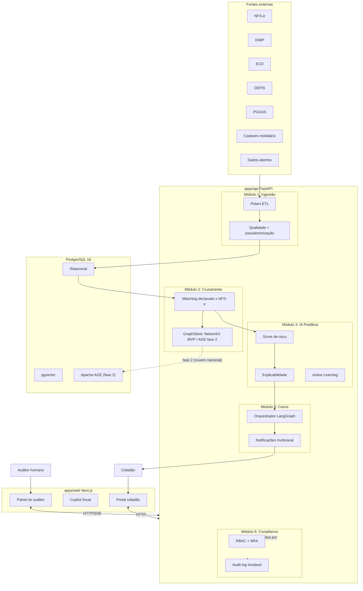
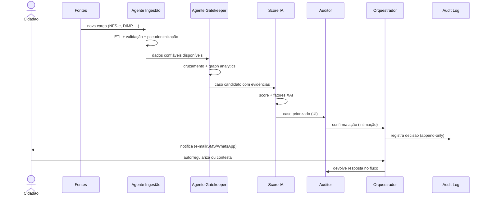

# Visão Arquitetural — FiscoCheck AI

## Contexto

A solução é um **mecanismo de triagem fiscal inteligente** que opera 24/7 com agentes autônomos, mas mantém o auditor como decisor final (`human-in-the-loop`). Atende ao Edital CPSI — Município de Brusque/SC.

## Princípios

1. **Human-in-the-loop:** agentes recomendam, auditor decide. Toda ação efetiva é registrada com `auditor_id` + timestamp + correlation-id.
2. **Sigilo fiscal e LGPD desde a origem:** pseudonimização antes de qualquer treinamento ou envio a LLM externo.
3. **Cadeia de custódia auditável:** logs imutáveis (append-only) com correlation-id propagado de ponta a ponta.
4. **Explicabilidade:** todo score de risco vem com fatores explicativos.
5. **Parametrização pela Secretaria:** pesos e regras configuráveis sem refactor.
6. **Interoperabilidade:** conectores via API que aceitam novas fontes sem alterar o núcleo.

## Visão de alto nível

## Stack

| Camada | Tecnologia |
|---|---|
| Frontend | Next.js 15 + TS + Tailwind v4 + shadcn/ui |
| Estado | Zustand (UI) + TanStack Query v5 (servidor) |
| Backend | FastAPI + Python 3.12 (async) |
| ORM | SQLAlchemy 2.0 + Alembic |
| ETL | Polars + PyArrow |
| Agentes | LangGraph |
| ML | scikit-learn + NetworkX |
| Banco | PostgreSQL 16 + pgvector (Apache AGE adiado — ver [ADR-0002](../adr/0002-database-mvp-replit.md)) |
| Cache/fila | Redis 7 |
| Lint/format | Biome (web) + Ruff (api) |
| Typecheck | tsc + Pyright |
| Testes | Vitest + pytest |

Detalhes e justificativas em [`../adr/0001-stack-inicial.md`](../adr/0001-stack-inicial.md).

## Fluxo típico (caso fiscal)

## Decisões pendentes (registrar como ADRs)

- Provedor de **identidade** (gov.br / Keycloak / Azure AD do município).
- Provedor de **notificações** (Resend / Twilio / Meta WhatsApp Business).
- **Hosting de produção** (AWS São Paulo / Azure Brazil South / nuvem TCE-SC).
- **Observabilidade** (Sentry + OpenTelemetry → qual coletor?).
- **Engine de regras** parametrizáveis (DSL própria? Drools? Conditional Logic em SQL?).

Veja [`../adr/`](../adr/) à medida que forem decididas.
