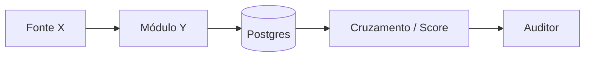

# RIPD — Relatório de Impacto à Proteção de Dados

> Template para preenchimento. Original: Resolução CD/ANPD nº 02/2022 (orientação).
>
> Quando uma operação envolver **risco elevado** (volume, sensibilidade, automação decisória, perfis), o RIPD é obrigatório. **Dado fiscal em massa configura risco elevado.**

---

## 1. Identificação

- **Operação:**
- **Data de elaboração:** AAAA-MM-DD
- **Versão:** 1.0
- **Elaborado por:**
- **Aprovado por (DPO):**

## 2. Contexto

- **Controlador:** Município de Brusque / Secretaria Municipal da Fazenda
- **Operador:** Beyond / Aurora
- **Sistema:** FiscalCheck AI — Plataforma de Inteligência Fiscal Agêntica
- **Módulo afetado (1–7):**
- **Edital:** CPSI — Brusque/SC

## 3. Natureza dos dados

| Categoria | Exemplos | Sensível? |
| --- | --- | --- |
| Identificação | CPF, CNPJ, razão social, nome | Não (mas protegido pelo sigilo fiscal) |
| Econômico-financeiro | Faturamento, NFS-e, declarações | Não (mas sob sigilo fiscal) |
| Cadastral | Endereço, e-mail, telefone | Não |
| Sensível (LGPD art. 5º II) | n/a | — |

## 4. Finalidade

<!-- Descrever a finalidade específica desta operação. -->

## 5. Base legal

- [ ] Cumprimento de obrigação legal/regulatória (art. 7º, II) — fiscalização tributária
- [ ] Execução de política pública (art. 7º, III)
- [ ] Outros: especificar

## 6. Fluxo de dados

<!--
Descrever fluxo: origem → transformação → armazenamento → eventual compartilhamento.
Pode usar diagrama Mermaid.
-->

## 7. Compartilhamentos

- [ ] Não há compartilhamento externo
- [ ] Compartilhado com (especificar quem, base legal, salvaguardas):

## 8. Tempo de retenção

<!--
Citar política em politica-retencao.md. Para dados fiscais, mínimo 5 anos
(art. 173 do CTN para constituir crédito tributário).
-->

## 9. Medidas técnicas e administrativas

- [ ] Criptografia em trânsito (TLS 1.2+)
- [ ] Criptografia em repouso (AES-256)
- [ ] Pseudonimização para ML/LLM
- [ ] RBAC com mínimo privilégio
- [ ] MFA para papéis privilegiados
- [ ] Audit log imutável
- [ ] Backup criptografado
- [ ] Monitoramento de acessos atípicos
- [ ] Treinamento periódico da equipe
- [ ] Plano de resposta a incidentes

## 10. Riscos identificados

| Risco | Probabilidade | Impacto | Tratamento | Risco residual |
| --- | --- | --- | --- | --- |
| Vazamento de dado identificável | | | | |
| Acesso não autorizado | | | | |
| Reidentificação de pseudonimizado | | | | |
| Decisão automatizada injusta | | | | |
| Discriminação algorítmica | | | | |
| Indisponibilidade prolongada | | | | |

Use escala: Baixa / Média / Alta.

## 11. Medidas adicionais propostas

<!-- Quando risco residual for Alta, propor mitigação. -->

## 12. Direitos do titular

Como esta operação atende cada direito (art. 18 LGPD):

| Direito | Como é atendido |
| --- | --- |
| Confirmação | Portal do cidadão (módulo 4) |
| Acesso | Portal do cidadão |
| Correção | Portal + canal DPO |
| Anonimização/bloqueio/eliminação | Sob avaliação do DPO + retenção legal |
| Portabilidade | Export CSV/JSON via portal |
| Eliminação | Sujeito à retenção legal fiscal |
| Revisão de decisão automatizada | Human-in-the-loop nativo (auditor decide) |

## 13. Decisões automatizadas

- [ ] Não há decisão **puramente** automatizada com efeito sobre o titular.
- [x] Há recomendação automatizada (score, próxima ação), mas o **auditor humano decide**.

Detalhes da explicabilidade:

<!-- Quais fatores explicam o score? Como o auditor é informado? -->

## 14. Aprovação

- **Elaborado por:** ____________________ Data: _**/**_/___
- **Revisado pelo DPO:** ____________________ Data: _**/**_/___
- **Aprovado pelo gestor:** ____________________ Data: _**/**_/___

## 15. Revisão programada

Próxima revisão: **AAAA-MM-DD** (mínimo: a cada 12 meses ou quando houver mudança material no tratamento).
