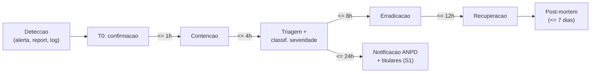

# Runbook — Resposta a Incidente em 24h

> SLA do edital: comunicar incidentes de segurança em até **24 horas** após confirmação.
> Base: LGPD art. 48 (comunicação à ANPD em prazo razoável) + edital CPSI.

## Definições

**Incidente de segurança** = qualquer evento adverso confirmado que possa comprometer:

- Confidencialidade (vazamento, acesso não autorizado).
- Integridade (alteração indevida de dado).
- Disponibilidade (parada de serviço crítico).

## Severidades

| Severidade | Critério | Notificação ANPD | Notificação titulares |
|---|---|---|---|
| **S1 — Crítica** | Vazamento confirmado de dado fiscal identificável OU indisponibilidade > 4h | Sim, **imediata** (≤ 24h) | Sim, conforme art. 48 |
| **S2 — Alta** | Acesso não autorizado contido OU comprometimento de credencial privilegiada | Avaliar caso a caso | Avaliar |
| **S3 — Média** | Tentativa bloqueada com sucesso OU vulnerabilidade explorável encontrada | Não obrigatória | Não |
| **S4 — Baixa** | Falha cosmética ou logging inadequado sem exposição | Não | Não |

## Linha do tempo de resposta

## Checklist operacional

### T+0 (detecção e confirmação)

- [ ] Registrar **timestamp de detecção** (timezone explícito).
- [ ] Quem detectou + como (alerta automático, report externo, etc.).
- [ ] Comunicar imediatamente o **DPO** e o **gestor da Secretaria**.
- [ ] Abrir war room (canal dedicado).

### T+1h (contenção)

- [ ] Desabilitar credenciais comprometidas.
- [ ] Isolar serviço afetado se necessário.
- [ ] Snapshot forense do estado atual (se possível, sem alterar evidência).
- [ ] **Não destruir logs**.

### T+4h (triagem)

- [ ] Classificar severidade (S1–S4).
- [ ] Identificar dados envolvidos (categorias + volume estimado).
- [ ] Identificar titulares afetados (quantos, quem).
- [ ] Identificar causa-raiz preliminar.

### T+8h (erradicação)

- [ ] Corrigir vulnerabilidade.
- [ ] Rotacionar segredos (`JWT_SECRET`, `PSEUDONYMIZATION_SALT`, chaves de API).
- [ ] Patch aplicado nos ambientes afetados.

### T+12h (recuperação)

- [ ] Restaurar serviço com versão corrigida.
- [ ] Monitorar reincidência por 48h.

### T+24h (comunicação externa)

Para S1:

- [ ] Comunicar **ANPD** via formulário oficial (`comunicacao@anpd.gov.br`).
- [ ] Comunicar **titulares afetados** quando o risco for relevante (LGPD art. 48 §1º).
- [ ] Comunicar **órgãos de controle** competentes (TCE, MP — se cabível).
- [ ] Comunicar **assessoria jurídica**.

### T+7 dias (pós-mortem)

- [ ] Reunião de pós-mortem **blameless**.
- [ ] Documento publicado em `docs/incidents/AAAA-MM-DD-titulo.md`.
- [ ] Ações corretivas com responsáveis e prazos.
- [ ] Atualizar este runbook se algo faltou.

## Conteúdo mínimo da comunicação à ANPD

1. Descrição da natureza do incidente.
2. Categorias de dados envolvidos.
3. Categorias e número aproximado de titulares afetados.
4. Medidas técnicas e de segurança aplicadas para proteger os dados, antes do incidente.
5. Riscos relacionados ao incidente.
6. Razões da demora, caso tenha havido.
7. Medidas adotadas ou que serão adotadas para reverter/mitigar efeitos.

## Conteúdo mínimo da comunicação aos titulares

- O que aconteceu (linguagem clara, em pt-BR).
- Que dados foram afetados.
- O que estamos fazendo.
- O que o titular deve/pode fazer (trocar senha, monitorar, etc.).
- Canal de contato do DPO.

## Contatos críticos

> Preencher quando definidos:

- **DPO controlador:** `<email>` / `<telefone>`
- **DPO operador:** `<email>` / `<telefone>`
- **Gestor da Secretaria:** `<email>` / `<telefone>`
- **Assessoria jurídica:** `<email>` / `<telefone>`
- **CSIRT do município (se houver):** `<email>` / `<telefone>`
- **ANPD:** `comunicacao@anpd.gov.br` | <https://www.gov.br/anpd>

## Treinamento

Simular incidente uma vez por semestre (tabletop exercise) e revisar este runbook após o exercício.
