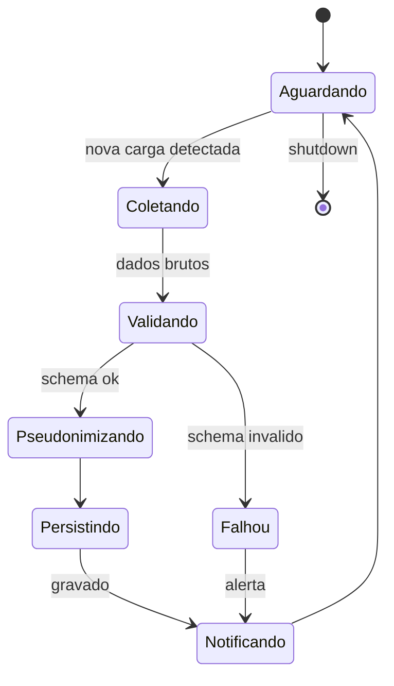

# Módulo 1 — Integração, Ingestão e Qualidade de Dados

> Consolidação multifonte e preparação confiável da base analítica.
> Pasta: `apps/api/src/fiscocheck_api/modules/ingestion/`.

## Objetivo (do edital)

> Integrar e consolidar bases heterogêneas (NFS-e, DIMP, ECD, DEFIS, PGDAS, PGDAS-D, cadastro mobiliário, dados abertos) em um repositório analítico unificado, com arquitetura orientada à interoperabilidade.

## Funcionalidades-chave

- **Ingestão Multifonte (ETL)** — conectores via API, sem refactor para adicionar fonte.
- **Agente 24/7** — monitora disponibilização de novas cargas, executa ETL, valida esquema/qualidade, sinaliza falhas antes que contaminem a análise.
- **Pseudonimização LGPD** — aplicada **antes** de qualquer treinamento ou envio a LLM.
- **Escalabilidade e Desempenho** — volume crescente sem degradação; Polars + particionamento.

## Arquitetura interna

```
modules/ingestion/
├── router.py         # endpoints de upload manual, status de cargas
├── service.py        # orquestração de pipelines
├── schemas.py        # Pydantic v2
├── models.py         # tabelas: source, load_run, load_artifact
├── repository.py
├── pipelines/        # uma subpasta por fonte
│   ├── nfse/
│   ├── dimp/
│   ├── ecd/
│   ├── defis/
│   ├── pgdas/
│   ├── cadastro_mobiliario/
│   └── dados_abertos/
└── quality/          # validações Great Expectations / Pandera-like
```

E o agente em `agents/ingestion/` (LangGraph):



## Dependências entre módulos

- **Saída:** dados normalizados e validados disponíveis para o módulo 2 (cruzamento).
- **Entrada:** todas as fontes externas + parâmetros de qualidade (mantidos no módulo 6).

## Métricas / SLA

- **Latência** entre disponibilização da fonte e dado pronto: objetivo ≤ 30 minutos para NFS-e (CTC); ≤ 24h para fontes em lote.
- **Taxa de falha de schema** sinalizada: 100% das cargas com schema diferente do esperado.
- **Cobertura de pseudonimização**: 100% dos campos identificáveis antes de qualquer treinamento.

## Decisões pendentes

- Orquestrador: **Prefect** vs **APScheduler** vs **Celery Beat**? (Recomendação inicial: Prefect, por observabilidade nativa.)
- Storage de artefatos brutos: **MinIO/S3** vs **filesystem** vs **bytea no Postgres**?
- Política de **idempotência**: chave natural por carga + dedupe.
