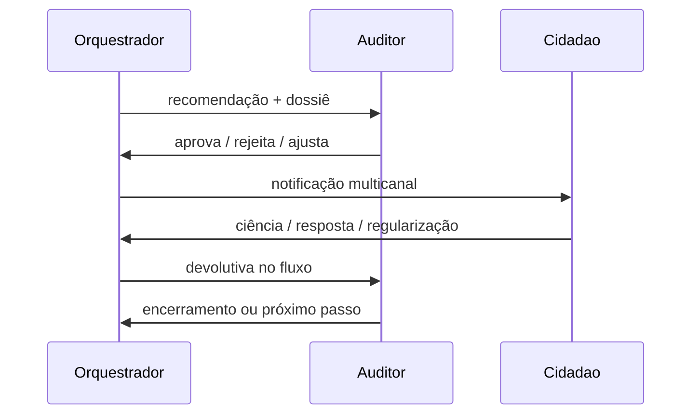

# Módulo 4 — Gestão da Fiscalização e Autorregularização

> Orquestração do ciclo do caso, do indício à regularização — sempre com decisão do auditor.
> Pasta: `apps/api/src/fiscalcheck_api/modules/cases/`.

## Objetivo (do edital)

> Recomendar a próxima melhor ação para cada caso (intimação, autorregularização, abertura de fiscalização), montar dossiê com evidências e operacionalizar a comunicação multicanal com o contribuinte.

## Funcionalidades-chave

- **Agente Orquestrador de Fiscalização** — recomenda ação a partir da fila priorizada.
- **Ação só após aprovação do auditor** — `human-in-the-loop` registrado.
- **Conformidade voluntária / autorregularização** — notifica, acompanha prazos, recebe devolutivas.
- **Notificações eletrônicas** — registro probatório auditável (ciência formal, prazos).
- **Canal multicanal com cidadão** — portal, e-mail, SMS, WhatsApp.
- **Gestão completa do caso** — anotações, prazos, acompanhamento, devolutivas.

## Entrega T16 · Portal do Contribuinte / Autorregularização (MVP web)

> Frente de UI do RF07/FA05, entregue no `apps/web` sobre a camada mock (MSW).

- **Portal `/citizen`** mobile-first com login mock (perfil Contribuinte ou botão "Entrar com gov.br"), acessível pelo contribuinte ou contador. Nenhum dado fiscal aparece sem identificação (guard de sessão) e o recorte do mock só expõe casos formalizados — triagem interna nunca chega ao cidadão (art. 198 CTN).
- **Fluxo acolhedor de 3 passos** (Ciência → Regularização → Confirmação): explicação da divergência em linguagem clara (`lib/citizen/plain-language.ts`), registro de ciência com protocolo, emissão de guia integral (DAM mock), simulador de parcelamento com adesão (`lib/citizen/parcelamento.ts` — 1–12x, piso R$ 100/parcela) que emite a guia da 1ª parcela, contestação com upload mock e agendamento de atendimento.
- **Devolutiva ao auditor (aceite T16 × T14)** — cada ação empilha uma `CitizenInteracao` (protocolo `PRT-2026-…`), atualiza `observacoes`/status do caso (adesão → `em_autorregularizacao`) e empurra notificação `devolutiva` para o sino do auditor.
- **Acompanhamento em tempo real** — linha do tempo das interações no detalhe da pendência + indicação dos canais de aviso (e-mail, SMS, WhatsApp).
- **Páginas institucionais** — `/citizen/termos` e `/citizen/privacidade` (LGPD + contato do DPO).

## Arquitetura interna

```text
modules/cases/
├── router.py
├── service.py
├── schemas.py
├── models.py            # caso, decisao, anotacao, notificacao, prazo
├── repository.py
├── orchestrator/        # agente LangGraph (próxima melhor ação)
├── notifications/       # adaptadores por canal
│   ├── email.py
│   ├── sms.py
│   ├── whatsapp.py
│   └── portal.py
├── dossie/              # montagem automática de dossiê
└── portal_cidadao/      # endpoints do portal de autorregularização
```

## Fluxo (caso típico)



## Dependências entre módulos

- **Entrada:** casos priorizados do módulo 3.
- **Saída:** desfechos para o módulo 5 (KPIs) e auditoria para o módulo 6.

## Métricas / SLA

- **Tempo médio** da notificação à ciência: ≤ 5 dias.
- **Taxa de autorregularização** sobre casos notificados: > 20% no piloto.
- **Latência de devolutiva** ao auditor: imediata (push) após resposta do cidadão.

## Decisões pendentes

- Provedor de e-mail: **Resend** (DX boa) vs **Amazon SES** (LGPD-aware São Paulo)?
- Provedor de SMS: **Twilio** vs **TotalVoice** vs **Pontaltech**?
- Provedor de WhatsApp: **Meta Business Cloud API direto** vs **Twilio**?
- Modelo de **prazos**: dias úteis vs corridos? Calendário do município?
- Política de **escalação** se cidadão não responder em X dias.
